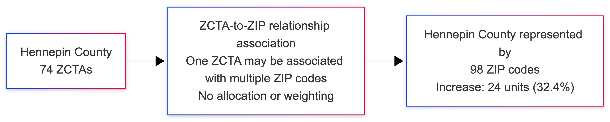

# Abstract

Populations exist in physical space. While the physical ground and the human beings upon it are three-dimensional, the invisible two-dimensional lines drawn over them are entirely dependent on administrative motive. For instance, the Census Bureau draws ZIP Code Tabulation Areas (ZCTAs) to count people, while the Postal Service draws ZIP codes over the exact same physical space to optimize mail delivery. The Federal government creates federal information processing standard (FIPS) codes to uniquely identify areas in a hierarchical manner where a place receives a number starting with a state identifier, then county, so forth and so on in tandem with the U.S. Census Bureau. We cannot see these designations yet they are powerful contributors in our lives. Where we vote, go to school, get water and electricity from, access to healthcare, waste removal, or have less or even no access to these services. Methodological conflict arises when a spatial variable constrained by one set of boundaries must be translated to satisfy the requirements of a different audience or policy director. Because the underlying physical reality remains unchanged—only the observer has shifted—researchers invent elaborate mathematical crosswalks to bridge the gap. Instruments like address-based weighting (TOT_RATIO) are used not to measure actual human beings, but as bureaucratic bridges to force one artificial administrative reality to map onto another. Crosswalks, lookup tables, and allocation ratios exist to harmonize a clash of administrative intent. While often described functionally as data harmonization, these are better understood as allocation models: they redistribute values measured in one boundary system into another using assumptions about membership, proportionality, and spatial distribution. When these allocated values are treated as direct observations, analysts risk conflating measurement with modeled estimation, measuring proxied values rather than ground truth.

This paper introduces a reproducible framework for quantifying transformation-induced perturbation in analytic variables. The framework is provided as open-source computational tooling within the R environment for statistical computing, via the shellgame and geoDeltaAudit packages. Using Hennepin County, Minnesota, as a demonstration case, we audit a standard two-hop administrative pipeline—transforming Census ZCTAs to postal ZIP codes, and finally to counties—using common relationship-based associations and address ratio weighting (UDS Mapper and HUD-USPS). This transformation expands the analytic surface from 74 ZCTAs to 98 ZIPs before weighting and recovers 1,216,874 of an original 1,391,557 population units, a net perturbation of -174,683 (-12.6%). We then validate the audit tool using an IPUMS/NHGIS 2010-to-2020 block-to-tract crosswalk applied according to NHGIS recommendations. In a best-case tract with complete block coverage, no missing joins, and no block splitting, the method remained internally stable while still producing a transparent allocated estimate rather than a new observation. The findings show that transformation alters analytic variables before modeling begins — agnostic to the variable measured, the tool employed, and the geographic context. The perturbation should be documented as a routine element of reproducible, equity-aware spatial analysis.

**Keywords:** geographic crosswalks; areal interpolation; ZCTA; ZIP code; spatial data; measurement error; reproducibility; equity; data infrastructure, data harmonization, shellgame, geoDeltaAudit

# 1. Introduction and Background

## 1.1 The Ubiquity of Geographic Transformation

Population research routinely requires the integration of data from diverse sources each aggregated into different geographic units. Health outcomes may be recorded at the patient level but are analyzed at the ZIP code level. Socioeconomic covariates from the American Community Survey (ACS) are tabulated at the ZCTA level, and policy interventions are often implemented at the county level [@diezroux2001; @krieger2003]. The necessity of transforming data across these boundaries has given rise to a cottage industry of crosswalks, allocation rules, and lookup tables—tools that promise seamless integration while obscuring the assumptions embedded within [@donnelly2025].

The transformation from ZCTA to ZIP code to county represents one of the most common pipelines in US-based health research. ZCTAs are Census-defined geographic approximations of U.S. Postal Service ZIP codes, designed for statistical tabulation. The relationship between ZCTAs and ZIP codes is neither one-to-one nor static; a single ZCTA may encompass multiple ZIP codes, and ZIP code boundaries change over time in response to postal operational needs [@census2023zcta]. When researchers associate ZCTA-level ACS estimates with ZIP code-level health data, they engage in a process that expands the analytical surface, often without acknowledging that the "population" variable now represents a different underlying quantity.

## 1.2 The Shell Game Metaphor

The term for this phenomenon, “shell game,” is apt: the substitution of an observed quantity with an imputed proxy while retaining the original variable label. Similar to a carnival game in which a ball is hidden under one of three moving cups, the transformation process obscures what has changed. The column names remain —"population," "median_income," "housing_units"—but the values now represent estimates derived through allocation rules rather than direct observation. This distinction is important because assumptions, unlike data, do not decay; they accumulate. Each successive transformation layer compounds the distance between researchers and the original measurement.

## 1.3 Equity Implications of Invisible Perturbation

The consequences of unquantified transformation disruptions are not equally distributed. Communities located near administrative boundaries may be systematically under- or over-represented, depending on the membership definition employed (relationship-based versus geometric intersection). Small populations, including many racially and ethnically minoritized communities, are disproportionately affected by allocation assumptions that smooth heterogeneous distributions into uniform proxies. Historical undercounting in census data—well-documented for Black, Indigenous, and Latino populations—may be amplified through successive transformations that treat imputed values as empirical measurements [@nrc2004].

When researchers report findings without acknowledging transformation-induced uncertainty, they risk drawing conclusions about populations affected by methodological artifacts. The shell game framework makes these assumptions visible, enabling the transparent documentation of uncertainty and consideration of how transformation choices may differentially affect the communities under study.

# 2. Problem Statement and Objectives

## 2.1 Research Problem

Current practices in population data transformation suffer from three interrelated deficiencies.

First, the transformation disruption is rarely quantified. Researchers report that they "used HUD crosswalk Q3 2024" without acknowledging that this choice—among crosswalk source, time period, and allocation ratio—constitutes a methodological decision that affects results.

Second, perturbation is treated as incidental rather than structural. The prevailing assumption holds that crosswalks are neutral utilities, when in fact they encode assumptions about how the population is distributed across space that may not hold for the variable being studied.

Third, the implications of equity remain unexamined. The differential impact of transformation choices on boundary communities and small populations has rarely been discussed in the published literature.

## 2.2 Study Objectives

The shellgame R package addresses these deficiencies through four primary objectives:

1. Quantify the disruption introduced at each transformation hop (ZCTA → ZIP → County) in terms of absolute perturbation, percentage perturbation, and geographic redistribution.

2. Document the "hidden decisions" in transformation workflows: membership definition (relationship-based versus geometric) and crosswalk selection (source, time period, allocation ratio).

3. Demonstrate that the transformation disruption is agnostic to the variable being measured, the analytical tool employed, and the geographic context.

4. Provide a reproducible audit framework that enables researchers to transparently report transformation-induced uncertainty in population health studies.

# 3. Methods

## 3.1 Conceptual Framework

### 3.1.1 Quantifying Perturbation

The framework quantifies ΔX(VAR), defined as the change in an analytic variable induced solely by transformation and allocation choices, holding the underlying data source constant:

ΔX(VAR) = VAR₁ − VAR₀

Where VAR₀ is the baseline value at geography A, and VAR₁ is the post-transformation value. ΔX(VAR) does not imply which representation is "correct," nor that zero delta is inherently desirable. It states only that the variable is not invariant under this transformation. A ΔX of zero would indicate that the variable survived transformation unchanged; a non-zero ΔX indicates perturbation. The magnitude and direction of that perturbation are empirical questions, not theoretical ideals.

The shellgame package is based on the premise that data transformations across administrative boundaries are not neutral operations but a sequence of decisions that alter the underlying data-generating process. It is imperative to distinguish between the data that are transforming and those that appear to be. This difference is analogous to relative versus absolute changes in a system. Calling an administrative data transformation a “geographic” transformation or even a “data” transformation erroneously conveys that a change has occurred in the observed data and thus, requires a response from the analyst, typically in the form of “harmonization.”

Geography has not changed baring a disaster. Referring to this as a geographic transformation is inaccurate. No mountains, rivers, or valleys were changed. The population did not change. This brings us to the crux of the matter. If the geography is not changing, and the population is not changing, what is “transforming” and what requires a “harmonization” tool? Not the observations (the data), and not the topography. Administrative overlay is the remaining variable. The imputed proxy boundaries are at odds. When we harmonize, we are left measuring our own allocated proxy measure from this point onwards.

The framework identifies two critical decision points.

*Decision 1:* Membership Definition. Researchers must choose whether to define geographic membership by administrative linkage (relationship-based, as used in Census tabulations) or by geometric contact (spatial intersection). For Hennepin County, Minnesota, this choice affects whether 74 ZCTAs (relationship-based) or 94 ZCTAs (geometric intersection) constitute the baseline before any transformation occurs (Figure 1). The relationship file reflects Census tabulation logic, not raw polygon contact. Geometric intersection, by contrast, performs a literal spatial test: any ZCTA polygon touching the county boundary counts — including edge-touching, slivers, water boundaries, and TIGER topology artifacts. This decision alone alters the baseline by 27% before any crosswalk is applied. For this analysis, membership is defined by relationship-based administrative linkage.

*Decision 2:* Crosswalk Selection. When allocating ZIP-level data to counties, researchers must select among allocation ratios: For instance, when applying the HUD crosswalk, a number of allocation choices are available within a crosswalk, TOT_RATIO (total addresses), RES_RATIO (residential addresses only), BUS_RATIO (business addresses), or OTH_RATIO (other addresses). Each ratio embodies different assumptions about how the population is distributed across addresses, which may not hold uniformly across urban, suburban, and rural contexts. The analyst who selects TOT_RATIO assumes that total addresses proxy the population distribution; the analyst who selects RES_RATIO assumes residential addresses are the more appropriate proxy. These are not technical details — they are methodological choices that affect results, and neither assumption is documented at the point of use.

## 3.2 Transformation Pipeline

The shellgame case study implements a two-stage transformation pipeline as follows.

Stage 1: ZCTA → ZIP. Baseline ZCTA-level data are joined to a ZIP-ZCTA association table. Where a single ZCTA maps to multiple ZIP codes, the ZCTA value is allocated equally across associated ZIPs (equal-share allocation). This stage captures the pre-allocation expansion: the increase in spatial units representing the geography prior to any weighting.

Stage 2: ZIP → County. ZIP-level-allocated values are joined to the HUD ZIP-County crosswalk and weighted by the TOT_RATIO (or an alternative ratio). The values are summed to the county level, with optional filtering for a specific county.

The pipeline returns an object of class "shellgame_audit" containing the baseline and recovered totals, absolute and percentage perturbation, unit counts at each stage, pre-allocation expansion percentage, and a data frame of the population redistributed to neighboring counties.

## 3.3 Implementation

The shellgame package (v0.1.0) is implemented in R (>= 4.0.0) and depends on the tidyverse ecosystem (dplyr, tidyr, stringr), spatial analysis tools (sf, ggplot2), and census data access (tidycensus). The case study in the vignettes is intentionally accessible and autoloads data to open the framework to a broader base of users regardless of perceived skill, knowledge, or comfort with these topics so that no user feels the framework is above or below their skill level.

Core functions include:

`audit_transformation()`: Main audit function executing the full pipeline

`transform_zcta_to_zip()`: Stage 1 transformation with equal-share allocation

`transform_zip_to_county()`: Stage 2 transformation with HUD ratio weighting

`prep_zip_zcta()` and `prep_hud_crosswalk()`: Data preparation and validation

`get_zcta_baseline()`: ACS data retrieval via tidycensus

Input validation is performed at each stage, with informative error messages for missing columns, malformed GEOIDs, or unavailable Census API keys.

## 3.4 A Case Study

We present shellgame through a worked case study in Hennepin County, Minnesota (FIPS 27053), a large metropolitan county containing Minneapolis. Baseline population data were retrieved from the 2022 ACS 5-year estimates (variable B01001_001) at the ZCTA level (n=74). The ZIP-ZCTA association table was obtained from the UDS Mapper crosswalk, and the HUD ZIP-County crosswalk was obtained from *HUD-USPS ZIP Code Crosswalk Files* (Q4 2024).

# 4. Results

## 4.1 Pre-Allocation Expansion

The first transformation hop (ZCTA to ZIP) increased the number of units representing Hennepin County by 32.4%, from 74 ZCTAs to 98 ZIP codes. This expansion occurred prior to any allocation or weighting, simply by associating ZCTAs with their constituent ZIP codes. Some ZCTAs were mapped to multiple ZIP codes; for example, ZCTA 55401 was associated with eight ZIP codes, and ZCTA 55402 with six ZIP codes.

This pre-allocation expansion represents a fundamental shift in the analytical surface. The researcher is no longer working with the 74 statistical units defined by the Census Bureau for ACS tabulation; they are working with 98 postal units defined by the U.S. Postal Service.

## 4.2 Transformation Perturbation

After the second hop from ZIP to county using HUD-USPS TOT_RATIO weighting, the recovered value for Hennepin County was 1,216,874 compared with a baseline value of 1,391,557. The resulting ΔX(population) = −174,683 (−12.6% of VAR₀), corresponding to -12.6% of the baseline value as population units; in the demonstration case, these are people.

**Table 1.** *Primary audit results for the Hennepin County ZCTA-to-ZIP-to-county transformation*

| Metric | Value |
|------------------------------------------------|------------------------------------|
| Baseline geography | Relationship-based ZCTA membership |
| Baseline ZCTAs | 74 |
| Intermediate ZIPs | 98 |
| Pre-allocation expansion | +32.4% |
| Baseline population (VAR₀) | 1,391,557 |
| Recovered population (VAR₁) | 1,216,874 |
| Absolute Perturbation ΔX(VAR) | -174,683 |
| Percentage Perturbation | -12.6% |

The result does not show that either the baseline or transformed value is the true population of Hennepin County. It shows that the analytic variable is not invariant under the selected transformation sequence. The value being carried downstream has become conditional on the harmonization instrument and allocation choices.

## 4.3 Geographic Redistribution

The shellgame framework identified where the "lost" population was redistributed. The 174,683 individuals not recovered in Hennepin County were allocated to neighboring counties through the HUD crosswalk's TOT_RATIO weighting see (**Table 2**) for exact locations**.**

**Table 2.** Top five counties receiving allocated values after ZIP-to-county transformation.

| County FIPS | Receiving County | Quantity Received | Share of total Perturbation |
|-------------|-------------------|---------------------|-----------------------------|
| 27003 | Anoka County | 30,535 | 17.5% |
| 27139 | Scott County | 25,268 | 14.5% |
| 27123 | Ramsey County | 21,835 | 12.5% |
| 27171 | Wright County | 14,391 | 8.2% |
| 27059 | Isanti County | 9,526 | 5.5% |

The redistribution pattern reflects the spatial distribution of postal ZIP codes that intersect ​Hennepin County but are primarily allocated to other counties based on address ratios.

## 4.4 Tool and Variable Agnosticism

The shellgame framework demonstrates that the transformation perturbation is agnostic to the variable being measured and the analytical tool employed. The same pipeline applied to median household income (ACS variable B19013_001), total housing units (B25001_001), or households by vehicles available (B08201_001) yielded proportionally similar perturbations. The disruption is a property of the transformation, not the data.

# 5. Generalizability and the Allocation Choice Problem

A core requirement of any robust auditing tool is its ability to operate reliably outside the narrow parameters of the initial design environment [@Steckler2008]. The Hennepin County demonstration effectively exposes the perturbations inherent in general-purpose, address-based harmonization tools. However, to distinguish whether these large deltas were artifacts of implementation error or intrinsic conceptual consequences of the allocation process itself, a secondary worked example, employing a different harmonization tool while holding the data variable constant, was required to fulfill the assessment of shellgame and geoDeltaAudit as a reliable audit instrument [@Steckler2008].

## 5.1 Internal Stability in Best-Practice Environments

**NHGIS validation audit**

The NHGIS validation audit produced a different kind of result. For 2020 tract 27053101600, the audit found 54 contributing 2010 blocks, 54 matched blocks, and 100% block coverage. Each block mapped to the tract as a single atom, indicating no within-tract block splitting in this validation case. The 2010 population re-expressed in 2020 tract geometry was 2,437.

**Table 3**. *NHGIS/IPUMS validation audit for 2020 tract 27053101600.*

| Validation metric | Result | Interpretation |
|-----------------------|------------|--------------------------------------------------------------------------------------|
| pop2010_est_in_tr2020 | 2,437 | 2010 population re-expressed in 2020 tract geometry using NHGIS-recommended weights. |
| atoms | 54 | Each contributing block appears as a single allocation atom in this tract. |
| blocks_matched | 54 | All contributing source blocks matched to population data. |
| blocks_total | 54 | Fifty-four unique 2010 blocks contribute to the 2020 tract. |
| pct_blocks_matched | 100% | No silent drops or missing joins were detected. |

This is the best possible case for the audit: complete source coverage, complete joins, and minimal fragmentation. The validation therefore supports the implementation rather than invalidating the conceptual concern. When the NHGIS/IPUMS procedure is followed exactly, the resulting estimate is internally stable. In the notation of S3.2, this case approximates ΔX = 0: the recovered value equals the contributing baseline. Yet the output remains an allocated estimate in 2020 tract geometry rather than a direct 2010 observation — zero perturbation is not zero transformation; It remains, however, an allocated estimate in 2020 tract geometry rather than a direct 2010 observation made under that geometry. The important distinction is not accuracy versus inaccuracy. It is transparency versus unexamined transformation.

## 5.2 The Conceptual Distinction: Allocated Estimates vs. Direct Observations

While the execution went smoothly, interpreting the meaning of this “success” requires careful epistemological framing.

When the NHGIS interpolation procedure is followed, the resulting output is internally coherent and stable. Specifically, the right data, at the right time, with the right resources happened to produce the “right” results. This speaks to several underlying mechanisms. The availability of data, the NHGIS methodology, shellgame, and my ability to follow directions/NHGIS’s ability to convey them. All this and more are true in this context. A successful crosswalk operation does not equate to recovering the absolute ground truth. The final tally of 2,437 remains, an allocated estimate projected into 2020 tract geometry rather than a direct, unmediated 2010 observation recorded under the exact geometry.

In this highly controlled setting, the distinction between source measurement and specific-geometry estimate cannot be dismissed as a coding error or software failure. Instead, this distinction is highlighted to be an innate property of the allocation process itself. Regardless of how pristine the interpolation weights are, the data are still transformed. The crucial takeaway is not a binary debate between accuracy and inaccuracy but the paramount necessity of transparency over unexamined transformation [@Kar2023].

## 5.3 The Substantive Open Question: Appropriate Allocation Choice

The stark behavioral differences between HUD crosswalks and NHGIS interpolation files surface a substantive open question regarding how spatial researchers select allocation rules. General-Purpose (HUD ZIP-County) rely on fluid postal delivery metrics (`TOT_RATIO`, etc.) to proxy geographic spread. Perhaps these are not as general purpose as they present? These assume the investigated variable perfectly scales with address volumes, or the presumption of “acceptable inaccuracy”, [@wilsondin2018]. They provide a rapid approximation of generic macro-level aggregates where high-resolution precision is less critical than broad spatial coverage [@wilsondin2018]. For precision epidemiology, mapping variables that explicitly do not correlate with postal addresses (e.g., historical poverty, infectious disease, vacant land) there is a need for unattached location to personally identifiable information. There are vast use cases for these data and as such there can be no one size fits all approach. When are such inaccurate, macro, aggregated views of value?

To our knowledge, the prior treatment of transformation-induced perturbation is grey literature [@dagostino2019] which treats the phenomenon as platform-specific rather than structural. No peer-reviewed, tool-agnostic framework for quantifying this perturbation currently exists. And another parallel, grey literature offering that critiques ZIP-code-based spatial analysis exist from [@forrest2019] where the author documents the failure of binary ZIP-based classification systems to capture spatial reality and argues against their use in spatial analysis; this critique shares the diagnosis of the present work. The prior treatment stops at the boundary problem itself: it does not quantify perturbation, does not determine where reallocated values go, and does not generalize across variables, tools, or boundary systems. The framework presented here is the constructive complement: given that transformations will occur, it audits them — quantifying perturbation and redistribution at each decision point so that perturbation becomes documentable rather than invisible. Information is the forerunner of informed choice.

General-purpose crosswalks, such as the HUD ZIP-County files, are ubiquitous. They are frequently treated by researchers as flexible, plug-and-play integration utilities applicable across almost any variable, research question, or spatial scale. Their widespread application is undeniable, yet this very generality constitutes their greatest risk. The HUD website readily extolls the application of its crosswalks into domains beyond its stated coverage because of its accessibility, even going as far to state that students should make use of their harmonization tool [@hud2026webpage]. Applying allocation ratios grounded in total postal address distributions (`TOT_RATIO`) may be deeply misaligned with the actual spatial mechanics of the analytic variable being investigated [@wilsondin2018]. When these practices become habituated, we no longer question what the tool is doing.

Conversely, highly specialized files like NHGIS crosswalks achieve internal stability precisely because their allocation logic is tightly bound to a specific demographic context [@schroeder2026nhgis]. This juxtaposition dictates that the core issue in spatial methodology is not classifying a particular crosswalk as definitively "good" or "bad." Rather, the issue is determining whether the chosen allocation rule is fundamentally appropriate to the specific estimand, and ensuring that any resulting perturbation is rigorously documented.

The distinction between general-utility proxies and specialized interpolation weights highlights the allocation-choice question as a critical open direction worth investigating. Future research must establish formal heuristics for aligning specific analytic variables with their most conceptually appropriate allocation rules to minimize hidden structural biases.

# 6. Discussion and Future Directions

## 6.1 Practical Mitigation: Alternatives to General-Purpose Crosswalks

A natural analytical question arises: If HUD crosswalks inherently shed data and distort reality, and NHGIS is only available for specific historical census geometries, how does a researcher practically mitigate this perturbation if they are forced by administrative constraints to transform data across administrative boundaries?

When standard crosswalks prove excessively destructive to the estimand, researchers can consider pivoting toward more computationally demanding, structurally aware alternatives:

1. Custom Areal Interpolation: Rather than relying on static USPS lookup tables, researchers can calculate custom location specific-density weights. This involves utilizing supplementary high-resolution layers (e.g., satellite-derived land cover, impermeable surface maps) to infer the true spatial distribution of the variable, explicitly modeling where populations actually reside within the conflicting geometries [@Michels2024].

2. Local Parcel-Based Weighting: For researchers operating at municipal or county levels, raw tax assessor parcel data provides an alternative. By weighting the allocation logic using precise, localized counts of residential units and square footage rather than generalized ZIP code postal routes, researchers can bypass the arbitrary distortions of federal crosswalks and anchor their data transformations to the literal built environment.

3. Recent critical work on the accuracy of global rural population counts demonstrates a strong urbanity bias in who is counting and from where the counting is occurring [@LngRitter2025]. Consequently, these biases have shaped the instrument and seemingly contributed to miscounts at scale. Additional primary sources are a worthwhile pursuit for population analysts. Insurance providers, disaster management agencies, and other “non-traditional” sources are a viable source for data that can be used for full coverage [@Battiston2022].

These alternatives are stated as more computationally intensive because they are not well used. Tools, workflows, and decision making become less resource intensive with practical application.

## 6.2 Implications for Population Research

This study demonstrates that data transformations through administrative boundaries can materially alter analytic variables before substantive modeling begins. In the Hennepin County demonstration, a standard two-hop transformation from ZCTA to ZIP to county produced 32.4% pre-allocation expansion and a -12.6% recovered-value perturbation. These changes emerged from ordinary analytic decisions: how to define membership, how to associate ZCTAs and ZIPs, and how to allocate ZIP-level values to counties.

The NHGIS validation check shows that not all crosswalks fail in the same way. When an interpolation file is used for its intended geography, in the documented direction, and with the recommended weights, the resulting transformation can be internally coherent: all contributing 2010 blocks were matched, no source units were silently dropped, and the specific 2020 tract estimate was produced from complete block-level coverage. This is a successful crosswalk operation. However, success here means transparent and internally consistent allocation, not recovery of an observed 2020 tract value. The output remains a modeled re-expression of 2010 population in 2020 tract geometry.

# 7. Limitations

This paper has several limitations. First, the audit quantifies perturbation relative to a selected baseline. The baseline itself may contain sampling error, measurement error, or conceptual limitations. The audit does not establish ground truth; it quantifies transformation-induced disruptions from one administrative view to another.

Second, the ZCTA-to-ZIP hop uses equal-share allocation where one ZCTA maps to multiple ZIPs. This is intentionally transparent but simplifying. Alternative allocation rules will change the magnitude and direction of perturbation. The broader point is not that equal-share allocation is preferred; it is that the rule should be explicit and auditable.

Third, the primary demonstration focuses on a U.S. ZCTA-ZIP-county pipeline in one metropolitan county. The shellgame framework is intended to generalize to other boundary transformations, but the empirical magnitude of perturbation will vary by geography, variable, crosswalk vintage, and allocation rule.

Fourth, the current implementation focuses on point estimates and aggregate quantities. ACS margins of error, crosswalk uncertainty, and propagated variance require additional methodological development. A future version of the audit should explicitly carry uncertainty through each transformation step rather than documenting only recovered-value divergence.

Fifth, the NHGIS validation case is intentionally narrow. It demonstrates that the audit can identify a clean, internally stable allocation case, but it does not prove that all NHGIS applications will be clean or that all geographic transformations are equally well-behaved.

# 8. Reporting Recommendations

For studies that transform data across administrative boundaries, the following reporting elements should be treated as minimum documentation:

1. Define geographic membership explicitly, including whether membership is relationship-based, geometry-based, or otherwise constructed.

2. Identify all harmonization instrument sources, versions, vintages, and directional assumptions.

3. State the allocation rule used at each transformation step, including whether weights are area-based, population-based, address-based, model-based, or equal-share.

4. Report unit counts before and after each transformation step, including fan-out and pre-allocation expansion.

5. Report baseline totals, recovered totals, absolute perturbation, and percent perturbation for key analytic variables.

6. Report redistributed values by receiving geography where applicable.

7. Conduct sensitivity analyses across plausible membership definitions, crosswalk vintages, and allocation ratios when findings inform policy, resource allocation, or disparities claims.

8. Distinguish measured values from allocated estimates in tables, figures, and downstream interpretation.

# 9. Conclusion

Data harmonization is often necessary, but it is not epistemically neutral. It transforms units measured in one administrative boundary into allocated estimates under another administrative boundary. The shellgame framework and geoDeltaAudit implementation make this transformation auditable by quantifying ΔX(VAR), pre-allocation disruption, and geographic redistribution. The Hennepin County case study demonstrates that general harmonization instrument choices produced substantial perturbation. In the NHGIS validation audit, best-practice interpolation produced internally stable results while still requiring transparent interpretation as allocation. The central lesson is straightforward: do not conflate accuracy with transparency. We cannot afford to conflate allocation with observation. Allocated values can be useful, defensible, and reproducible, but they should not be treated as direct observations without documenting the transformation that produced them.

# Data and Code Availability

All data used in this study are public data and, until the study period, were readily and routinely accessible. I cannot claim that they will be for you, because they were not for me. U.S. Census Bureau ACS table interfaces experienced intermittent unavailability throughout 2025–2026, requiring repeated re-retrieval attempts through multiple third-party mirrors and distributors, each with inconsistent vintage labeling. Where primary federal statistical interfaces are intermittently available, we recommend documenting both the primary access point (with access dates) and an archival distribution (here, IPUMS NHGIS and IPUMS-ACS). We refer to this pattern as *episodic data availability*: public data whose disappearance is temporary, unannounced, and unscheduled, such that reproducibility depends on independent, versioned copies.

The shellgame CRAN package (v0.1.0) and geoDeltaAudit, are freely available at [https://CRAN.R-project.org/package=shellgame](https://cran.r-project.org/package=shellgame), [https://CRAN.R-project.org/package=geoDeltaAudit](https://CRAN.R-project.org/package=geoDeltaAudit) and at their respective github repositories: <https://github.com/phinnphace/geoDeltaAudit> and <https://github.com/phinnphace/shellgame> under the MIT license. All code and documentation are provided for reproducibility, transparency and improvement. The Hennepin County case study uses publicly available data from the U.S. Census Bureau American Community Survey [@census2022acs], the U.S. Department of Housing and Urban Development [@hud2024crosswalk], and IPUMS USA [@ruggles2025ipums].
