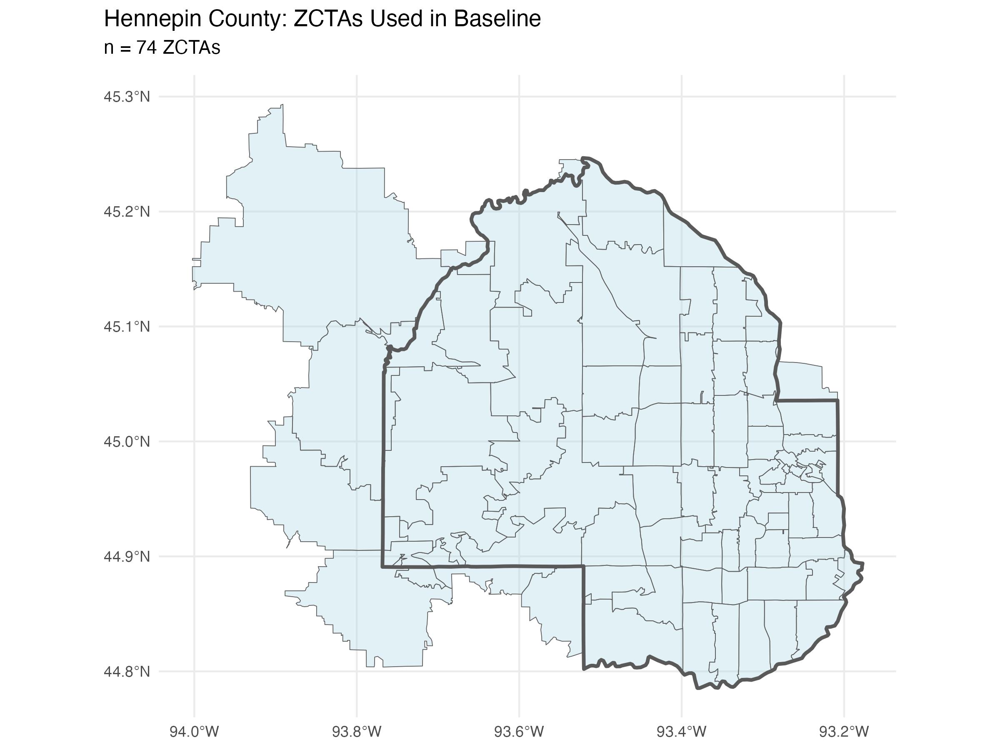
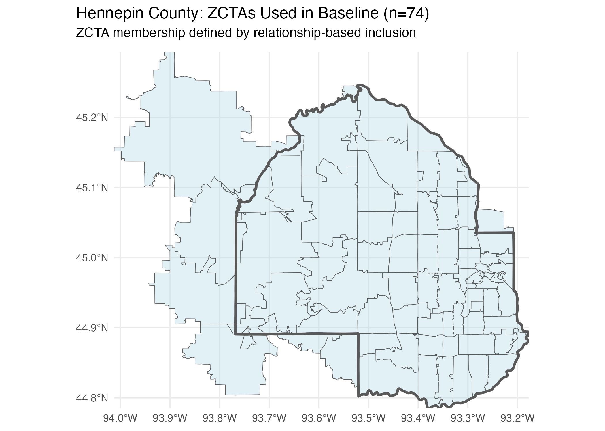

```{r setup, include=FALSE}
knitr::opts_chunk$set(
  eval = FALSE,
  message = FALSE,
  warning = FALSE,
  error = FALSE
)
```

```{r libs}
library(shellgame)
library(geoDeltaAudit)
library(dplyr)
library(stringr)
library(janitor)

# vignette-only dependency; keep in Suggests
if (!requireNamespace("readr", quietly = TRUE)) {
  stop("Package 'readr' is required to run this vignette. Install it with install.packages('readr').")
}
```

# Introduction

This vignette demonstrates a complete transformation audit using Hennepin County, Minnesota as an example. We'll track total population through the transformation chain:

**ZCTA → ZIP → COUNTY**

And reveal the shell game: same column name ("population"), different underlying quantity (observed → imputed).

# The Workflow

## Step 1: Prepare the Data

For this example, we'll use the data you would typically prepare:

```{r eval=FALSE}
acs_path <- system.file("extdata", "toy_acs_zcta_hennepin.csv", package = "geoDeltaAudit")
hud_path <- system.file("extdata", "toy_zip_county_hud_hennepin.csv", package = "geoDeltaAudit")

stopifnot(nchar(acs_path) > 0, nchar(hud_path) > 0)

acs <- readr::read_csv(acs_path, show_col_types = FALSE) |>
  janitor::clean_names() |>
  dplyr::mutate(zcta = stringr::str_pad(as.character(.data$zcta), 5, pad = "0"))

hud <- readr::read_csv(hud_path, show_col_types = FALSE) |>
  janitor::clean_names()

# Toy assoc: 1:1 ZCTA -> ZIP so the example always runs
assoc <- acs |>
  dplyr::distinct(.data$zcta) |>
  dplyr::transmute(zcta = .data$zcta, zip = .data$zcta) |>
  dplyr::distinct()

list(
  acs_rows = nrow(acs),
  assoc_rows = nrow(assoc),
  hud_rows = nrow(hud)
)
```

## Step 2: Run the Audit

```{r run-audit, eval=FALSE, echo=TRUE}
# example only (not executed during vignette build)
result <- shellgame::evaluate_transformation(
  data = acs,
  zip_zcta_map = assoc,
  hud_crosswalk = hud,
  geo_col = "zcta",
  var_col = "pop"
)
```

## Step 3: View Results

```{r eval=FALSE}
# Print summary
summary(out)
```
## Membership Visualization

```{r figures, echo=FALSE, eval=TRUE}
knitr::include_graphics(c(
  "baseline_hennepin.png",
  "hennepin_relationship.png"
))
```

```text
=== The Shell Game: Transformation Audit ===


Variable: population 
Target County: 27053 

--- Baseline (Observed Data) ---
  Units: 74 ZCTAs
  Total: 1,391,557 

--- After Transformation (Imputed Data) ---
  Intermediate:  98  ZIPs
  Recovered: 1,216,874 

--- The Shell Game Result ---
  Perturbation: -174,683 (-12.6%)

  Same column name.
  Different underlying quantity.
  That's the shell game.

--- Pre-Allocation Expansion ---
  74 ZCTAs → 98 ZIPs (+32.4%)
  This happens BEFORE any allocation or weighting.
  The analytical surface has already shifted.

--- Top Counties Receiving Perturbed Population ---
  27003: 30,535
  27139: 25,268
  27123: 21,835
  27171: 14,391
  27059: 9,526
```
## Baseline: 74 ZCTAs

The analysis begins with 74 ZCTAs that have a relationship-based membership with Hennepin County. These are the ZCTAs used by the Census Bureau in ACS tabulations.

**Total population: 1,391,557** (directly observed from ACS)

```{r baseline-fig, echo=FALSE, eval=TRUE}

```
## The First Hop: ZCTA → ZIP

When we associate these 74 ZCTAs with ZIP codes:

- ZCTA 55401 → 8 ZIPs
- ZCTA 55402 → 6 ZIPs  
- Several others → 2-5 ZIPs

**Result: 74 ZCTAs become 98 ZIPs (+32.4%)**

This happens **before any allocation**. The analytical surface has already shifted.

## The Second Hop: ZIP → County

Using HUD's TOT_RATIO, we allocate ZIP-level population to counties.

**Result: Population recovered for Hennepin County: 1,216,874**

## The Perturbation

**174,683 people (-12.6%) disappeared in the transformation.**

Where did they go? To neighboring counties:

```{r eval=FALSE}
extract_perturbed_population(result, top_n = 5)
```

# Geometric vs Relationship Membership


If we used geometric intersection instead of relationship-based membership, we would have 94 ZCTAs, not 74.

**This is Decision #1**: How do we define membership?

The 20 extra ZCTAs (shown in grey) intersect the county boundary geometrically but are not included in the relationship-based membership used by ACS.
# Visualizing the Difference

```{r baseline-membership, echo=FALSE, eval=TRUE}

```

The baseline: 74 ZCTAs with relationship-based membership.
```{r geometric-membership, echo=FALSE, eval=TRUE}

```

The difference: Grey areas show ZCTAs that appear only under geometric intersection.


# The Shell Game Revealed

```{r eval=FALSE}
# Normalize expected fields from geoDeltaAudit::audit_transform()
baseline_total <- as.numeric(audit_result$baseline_total)
final_total <- as.numeric(audit_result$final_total)

# delta is already provided; compute if missing
delta <- if (!is.null(audit_result$delta)) {
  as.numeric(audit_result$delta)
} else {
  final_total - baseline_total
}

absolute_perturbation <- abs(delta)
```

Same column name: "population"  
Different underlying quantity: observed → imputed

**That's the shell game.**

# Why This Matters

This error is **agnostic** to:

- **Variable**: Try this with median income (B19013_001) - same % error
- **Tool**: Run this in Python or Stata - same % error
- **Geography**: Try another county - same pattern

**The transformation is the cause, not the tool or variable.**

# Next Steps

- Try this audit with your own geography
- Test with different ACS variables
- Compare different crosswalk versions
- Document your hidden decisions

See `vignette("data-preparation")` for how to prepare your own data.
See `vignette("understanding-shell-game")` for the conceptual explanation.
